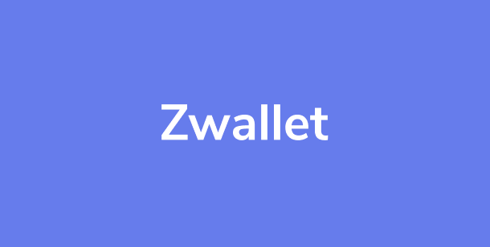

# MyMonee
 




## About This Project
Zwallet is an e-wallet application that simplifies your financial needs and can save a lot of time on your banking needs with just single apps.

Until the current Minimum Viable Product, Zwallet now has been able to transfer between users, other features will continue to be developed.

## Tech in Use
In this project, we use several technology / library to create this App :
- Swift 5
- Cocoapods
- VIPER Design Pattern

Third party dependencies
- [Moya](https://github.com/Moya/Moya)
- [KingFisher](https://cocoapods.org/pods/Kingfisher)
- [OTPTextFieldView](https://github.com/Root-vb/OTPFieldView)
- [Netfox](https://github.com/kasketis/netfox)

## Screenshoot
Here some screenshot of Zwallet App  
[](Login)
[](Home)
[](FindReceiver)
[](SetAmount)
[](TransactionSuccess)
[](TransactionHistory)

## Installation

### Prerequisite
- Swift 5
- Xcode
- Cocoapods

### Clone this repository
1. Create a directory in your local storage
2. Open terminal at your directory and type :
```
git clone [this repo link]
```
3. Using [cocoapods](https://cocoapods.org/) to install the dependencies. type :
```bash
pod install
```
4. Go to `/App` Folder and open `Zwallet.xcworkspace`
5. Run the application in mobile or simulator running with minimum iOS 11

## VIPER Design Pattern


1. View  
   The responsibility of the view is to send the user actions to the presenter and shows whatever the presenter tells it

2. Interactor  
   The Interactor is a class that mediates between the presenter and the data. It takes direction from the presenter

3. Presenter  
   Its responsibility is to get the data from the interactor on user actions and after getting data from the interactor, it sends it to the view to show it. It also asks the router/wireframe for navigation

4. Entity  
   The Entity contains basic model objects used by the Interactor

5. Router  
   The Router handles navigation between screens/ It has all navigation logic for describing which screens are to be shown when
